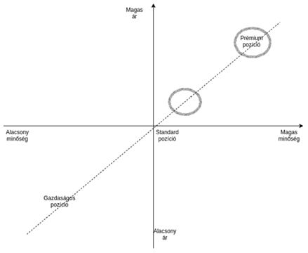

# AgroFuture üzleti terv

## Tartalomjegyzék

- [AgroFuture üzleti terv](#agrofuture-üzleti-terv)
  - [Tartalomjegyzék](#tartalomjegyzék)
  - [Bevezetés](#bevezetés)
  - [Vezetői összefoglaló](#vezetői-összefoglaló)
    - [Az üzleti terv célja](#az-üzleti-terv-célja)
    - [A vállalkozás leírása](#a-vállalkozás-leírása)
    - [A célpiac elemzése és előrejelzése](#a-célpiac-elemzése-és-előrejelzése)
    - [Piacra lépési stratégia](#piacra-lépési-stratégia)
    - [A vállalkozó team](#a-vállalkozó-team)
    - [Gazdasági előrejelzés, pénzigény](#gazdasági-előrejelzés-pénzigény)
  - [Piaci viszonyok](#piaci-viszonyok)
    - [Célcsoport vizsgálata](#célcsoport-vizsgálata)
      - [Szegmentáció](#szegmentáció)
      - [Pozicionálás](#pozicionálás)
    - [Piaci helyzet](#piaci-helyzet)
      - [Ágazati helyzet](#ágazati-helyzet)
      - [Versenytársak](#versenytársak)
      - [Lehetőségek és korlátok](#lehetőségek-és-korlátok)
      - [Előrejelzések](#előrejelzések)
  - [Termelési és Szolkágltatási Terv](#termelési-és-szolkágltatási-terv)
    - [Termékek szolgáltatások](#termékek-szolgáltatások)
      - [Technológia](#technológia)
      - [Telephely, eszközök](#telephely-eszközök)
      - [Szállítók / Beszállítók](#szállítók--beszállítók)
      - [Disztribúció](#disztribúció)
    - [Vállalkozás jellemzői](#vállalkozás-jellemzői)
      - [Munkaszervezés, adminisztráció](#munkaszervezés-adminisztráció)
      - [Hatáskörök](#hatáskörök)
      - [Munka- és felelősség megosztása](#munka--és-felelősség-megosztása)
      - [Szakmai önéletrajzok, referenciák](#szakmai-önéletrajzok-referenciák)
  - [Marketing terv](#marketing-terv)
    - [Kommunikációs stratégia](#kommunikációs-stratégia)
      - [ATL kommunikáció](#atl-kommunikáció)
      - [BTL kommunikáció](#btl-kommunikáció)
    - [Törzsvásárlói Kedvezmény Program](#törzsvásárlói-kedvezmény-program)
  - [Kockázatbecslés](#kockázatbecslés)
    - [SWOT-analízis](#swot-analízis)
  - [Pénzügyi terv](#pénzügyi-terv)
    - [Előzetes jövedelem- és eredménykimutatás terv](#előzetes-jövedelem--és-eredménykimutatás-terv)
    - [Pénzforgalmi/likviditási előrejelzés](#pénzforgalmilikviditási-előrejelzés)
    - [Előzetes mérleg](#előzetes-mérleg)
    - [NPV, BMR](#npv-bmr)
    - [Szükséges pénzforrás](#szükséges-pénzforrás)
  - [Mellékéetek](#mellékéetek)
    - [Pénzügyi tervező Excel táblázat](#pénzügyi-tervező-excel-táblázat)

## Bevezetés

| Név            | AgroFuture                    |
| -------------- | ----------------------------- |
| Székhely       | Veszprém                      |
| Jogi forma     | Korlátolt Felelőségű Társaság |
| Bankszámlaszám | 12345678-12345678-12345678    |
| KSH szám       | 16844865-1102-116-19          |
| Adószám        | 12345671-2-19                 |
| Cégjegyzékszám | 19-08-167154                  |

| Megvalósítási összeg |     |
| -------------------- | --- |

| Tulajdonosok     | Tulajdonosi arány |
| ---------------- | ----------------- |
| Barki Richárd    | 25%               |
| Csáktornyai Ádám | 25%               |
| Gombos Bence     | 25%               |
| Szabados Dávid   | 25%               |

---

## Vezetői összefoglaló

### Az üzleti terv célja

- Tájékoztatás a vállalkozásról
- A vállalkozás teljesítményének értékelése
- A vezetés információs rendszerének javítása
- Információszolgáltatás a kivitelezők, befektetők számára

Honnan indul a vállalkozás?
Milyenek az adottságai?
Hová akar eljutni és mennyi idő alatt?
Milyen eszközök és források igénybevétele szükséges a célok eléréséhez?

Vállalkozásunk 2022.12.01-el megnyitja kapuit azok előtt akik a földművelést és a
növénytermesztést szeretnék mesteerfokra fejleszteni akár otthonukban akár ipari
környezetben.Fő tevékenységeink közé tartozik a mezőgazdasági termelést elősegítő okos eszközök gyártása, értékesítése és reklámozása. A termékek képesek a víz-, a talajminőség, az időjárás elemzésére és ezen adatok mentésére használhatóak. Az adatok
megtekinthetőek, lementhetőek, automatikusan naplózhatóak. Az elmentett értékekből
elemzéseket, kimutatásokat készítethetünk a rendszerrel, amik segítenek a termelés
fellendítésében.

### A vállalkozás leírása

A vállalkozásunk Korlátolt Felelőségű Társaság céges formában jön létre azért mert több földműves tevékenység
megkívánta ennek használatát.
A készülékekkel továbbá automatizált öntözés és egyéb automatikus folyamatok is
megvalósíthatóak, ezek elősegítik a víz optimális felhasználását, ezáltal csökkentve a
felhasznált édesvíz mennyiségét melyből földünkön limitált készletek állnak
rendelkezésre folyékony állapotban. Az édesvíz mennyisége csupán 3%-a a Föld
vízkészletének, amelynek jelentős része (kb. 80%-a) a sarki jégtakaróban található,
így a valóban rendelkezésre álló édesvízkészlet a Föld teljes vízkészletének csupán 0,5
%-a. A vízzel úgy tudunk spórolni, hogy a öntözés csak adott helyeken történik, a
vetett / ültetett növényeknek megfelelő időközönként, az időjárást és a talaj állapotát
is figyelembe véve.
Komoly figyelmet fordítunk a fenntarthatóságra. A termékeink élettartama ezért
magas, és részben újrahasznosított anyagokat is használunk. Például a felhasznált
nemesfémek egy részét más gyáraktól vesszük amit nem tudtak már felhasználni vagy
melléktermékként keletkezett náluk.

### A célpiac elemzése és előrejelzése

Célcsoprotunk bárki aki mezőgazdasággal növénytermesztéssel fogalalkozik vagy fejleszteni szeretné 

Sikeres cégek úgy határozzák meg tevékenységüket, hogy azt is belefoglalják ki a célpiacuk. Például könyvelés kiskereskedők számára vagy luxusnövények a felső tízezer számára vagy üzleti angol ügyvédeknek stb.
Hiba: a túl széles célszegmens meghatározás, a túl sokféle vevővel való kapcsolat, mert csak általános mondanivalóval lehetséges. Általános mondanivalónak gyenge marketingüzenete van a cégre nézve.
A célszegmens kiválasztásánál fontos, hogy könnyen, olcsón lehessen vele kapcsolatot teremteni, kommunikálni.

1. Szegmentációs ismérvek kiválasztásaú
2. Szegmensek jellemzése
3. Piacok felvevőképességének becslése
4. Célpiacok kiválasztása
5. Lehetséges pozícionálási szempontok meghatározása
6. A pozícionálás közvetítése a fogyasztó felé

Szegmentáció
Követelményei:

- Mérhetőség: az adatoknak hozzáférhetőknek kell lenni
- Elérhetőség: nem elég egy csoportot azonosítani, azt is fel kell tárni, milyen eszközökkel érhető el az adott szegmentum
- Időbeli stabilitás: a kialakított szegmentumoknak hosszú időn keresztül változatlanul kell maradni
Előnyei:
- gyorsabbá válik a keresletváltozás követése
- kidolgozhatóvá válnak speciális marketingprogramok
Hátrányai:
- megköveteli a piac folyamatos vizsgálatát
- költségek magasabbak
Célpiacok kiválasztása: A célpiac tudatosan kiválasztott szegmentumait célpiacnak nevezzük
- fontos:
  - a szegmentumok mérete és növekedése
  - a szegmentum elérhetősége
  - a vállalati célok és erőforrások
Pozícionálás
Konkurenciához mért versenyelőnyök meghatározása.
Előnye az egyértelműség. Igény mutatkozik a relevancia iránt. Koherenciát vár el a cégimázs terén. 
Egyediség a versenytársak irányába.
A siker titka a jó pozícionálás.
- „A marketing egyik leghatékonyabb fegyvere, hogy birtokoljunk egy szót a potenciális vevő 
koponyájában.” (Ries-Trout)
- fontos megtalálni, hogy cégünk kínálata miben különbözik a hasonló méretű és funkciójú 
vállalkozásoktól
  - ki kell tűnni közülük
A fogyasztó koponyája
- nemcsak az a lényeg, hogy mit tudunk a vevőkről
- az is lényeg, hogy a vevő mit tud rólunk
- egyetlen valóság
- út a fogyasztó koponyájába
  - legyen első
    - Xerox a fénymásolásban
    - Coca a kólák piacán
    - RedBull az energiaitalok közt
    - Kodak a fotózásban
    - a város elsőszámú borétterme vagy gyermekzsúr szervezője
Pozícionálás lényege:
- nem valami újat és teljesen különbözőt alkotni, hanem jó értelemben manipulálni, ami a fogyasztók agyában van
- kapcsolatot teremten

### Piacra lépési stratégia

Reklámokkal, szponzorációkkal, szeretnénk felhívni a figyelmet a leendő szolgáltatásainkra és termékeinkre. Emellett közösségi médiában illetve saját honlapunkon is megtalálható lesz az elérhetőségünk, a különféle akciók.

Hírdetés fő módjai:

- Google kiemelés
- közösségi felületek, mint például Instagram és TikTok
- szponzoráció YouTube és Twitch felületeken
  - elektronikai eszközökkel foglalkozó tartalomgyártók
  - hasonló témájú játékokat közvetítő videósok (Farming Simulator)

Az utolsó pontban említett helyeken főleg a személyes felhasználásra tervezett termékeink célközönségét érhetjük el.

### A vállalkozó team

A négy tulajdonos, végzettségük és tapasztalatuk alapján megfelelő szakemberként képesek
részt venni a vállalkozás működésében. A tulajdonosok nem csak saját szakterületükért
felelnek. Közösen végzik el a szükséges munkálatokat, együtt hozzák létre a családi
hagyományokra épülő kézműves borászati termékeket.

Barki Richárd elektronikai és szoftverfejlesztő tapasztalattal rendelkezik. Fő feladata a különféle
termékek kitalálása és ezen termékek specifikáció. Kapcsolattartás meglévő partnerekkel.

Szabados Dávid a pénzügyi és értékesítési feladatokat látja el. Naprakészen könyveli a számlákat,
megrendeli és beszerzi a szükséges eszközöket, biztosítja a munka-és tűzvédelmi előírásban
foglalt felszereléseket, irodaszereket, nyilvántartást vezet.

Gombos Bence a marketingért és a piaci jelenlétünkért felelős. Feladata a helyi és regionális közösségi médiában való reklámok elkészítése, a szponzorációk intézése. A marketing anyagok megtervezése.

Csáktornyai Ádám szoftverfejlesztési feladatokat látja el az irodában, közvetlen kommunikációban van a különböző részlegek között.

### Gazdasági előrejelzés, pénzigény

---

## Piaci viszonyok

### Célcsoport vizsgálata

Számunkra fontos a környezetvédelem, ezért szeretnénk minél nagyobb csoportnak forgalmazni termékeinket.
A célcsoportunk kettő fő részre osztható:
Az első rész B2B azaz Business t  - Business modellnek megfelelően a nagy termelőket foglalja magába. Nekik magas minőségű, prémium eszközöket és szoftvermegoldásokat tudnánk szolgáltatni.
A második rész B2C azaz Business t  - Customer modell alapú. Ide tartoznak a magán termelők akik piacra vagy önfenntartó módon termelnek vagy a hobbi szinten kertészkedők. Akiknek megfizethetőbb, kevesebb funkcióval rendelkező, de versenyképes minőségű termékeket árusítanánk.

#### Szegmentáció

Itt fontos tudnunk hogy mennyire lesz keresett a termék mennyire lesz kelendő a különböző korosztály számára. Azt is tudnunk kell hogy melyik égtájon milyen átalakításokra, módosításokra lenne szükségünk hogy termékünk tökéletesen tudjon teljesíteni a különböző éghajlati körülmények és felhasználás milyensége függvényében.

#### Pozicionálás

Az elsődleges célcsoportunk anyagi hátteréből adódóan elsősorban magas minőségű és ezzel egyensúlyban magas árú, prémium termékeket keres. A prémium pozíciós
termékeink ára a minőséget és a strapabíroságot tükrözik, de ennek ellenére ár érték aránya kiemelkedő a piacon. Ebben az árkategóriában prémium támogatás és beszerelés és egyéb plusz szolgáltatások is járnak a magas árcédula mellé, amik tökéletesek a nagyipari célcsoport számára.
A másik termékvonalunk egy megfizethetőbb, alacsonyabb minőségű, de időtálló eszközökből állna. Ezen berendezéseink árazása közelebb áll a standard pozícióhoz, a piacon szintén kiemelkedő ár érték arányt képviselnének. Ezen termékek tökéletesek az otthoni felhasználásra, az árakat is figyelembe véve.

### Piaci helyzet

#### Ágazati helyzet

#### Versenytársak

| Smart Farming KFT  |                           |
| ------------------ | ------------------------- |
| Alapítás           | 1991                      |
| Székhely           | Magyarország, Nyíregyháza |
| Tulajdonosok száma | 1 fő                      |
| Árbevétel          | 36 642€                   |

Tevékenysége:

A NEXT Farming – a FarmFacts GmbH márkajegye – a tapasztalatot, a mélyreható digitális tudást és a mezőgazdaság széles körű támogatását képviseli. A célkitűzésünk, hogy a mezőgazdaság üzleti folyamatait költségkímélő és erőforráskímélő módon optimalizáljuk. Ezt folyamatos fejlesztésű termékpalettával és teljesen gyakorlatias felhasználással érjük el. Így a NEXT Farming nemcsak az üzletág élenjáró vállalata, hanem a mezőgazdászok fontos partnere is. Rugalmas és összekapcsolt termékek az egymástól elszigetelt megoldások helyett - okos, egységes és egyedi módon összeállítva minden üzemnek.

| PC-Agrár KFT       |                        |
| ------------------ | ---------------------- |
| Alapítás           | 2019                   |
| Székhely           | Magyarország, Kaposvár |
| Tulajdonosok száma | 3 fő                   |
| Árbevétel          | 139 986€               |

Tevékenysége:

A PC Agrár Kft. minden szolgáltatása német nyelven is igénybe vehető, amely természetesen a könyveléssel kapcsolatos táblázatokat, elemzéseket is magába foglalja (főkönyvi kivonat, mérleg stb.). A PC Agrár Kft a következő, széleskörű szolgáltatásokat kínálja: - Könyvelés - Agrár-Office - Az integrált mezőgazdasági szoftvercsomag - Segítségnyújtás a mezőgazdasági vállalatok, egyéni gazdák felkészítéséhez az EU tagsággal előálló új helyzetre és tájékoztatás az igényelhető uniós támogatásokról - Információszolgáltatás, tanácsadás és oktatás - Projekttervezés és irányítás - Segítségnyújtás támogatási pályázatok elkészítéséhez - Üzemi számítástechnikai állapot felmérése és kiépítése - Tanácsadás a termelés irányításához és tervezéséhez - Üzemgazdasági tanácsadás - Adatrögzítés- és kiértékelés koordinálása kisebb üzemek és egyéni gazdák esetében

| Pycn  -            |               |
| ------------------ | ------------- |
| Alapítás           | 2014          |
| Székhely           | Spanyolország |
| Tulajdonosok száma | 2 fő          |
| Árbevétel          | 515 000$      |

Tevékenysége:

Vezeték nélküli termőföld szenzorok gyártása és ezekhez szoftver felület fejlesztése, ezekhez az eszközökhöz nyújtanak háttér támogatást. Több információval szolgál a földek állapotáról így pontosabb jobb tápanyag és csapadék adagolást tudnak biztosítani. Növelik a termékenységet és csökkentik az erőforrás felhasználását. Ezáltal ők is figyelnek a fenntarthatóságra.

| LumiGrow           |                 |
| ------------------ | --------------- |
| Alapítás           | 2007            |
| Székhely           | California, USA |
| Tulajdonosok száma | 2 fő            |
| Árbevétel          | 19 500 000$     |

Tevékenysége:

Okos fényforrások és állítható spektrumu LED-ek gyártása. Állításuk szerint a termékeik segítségével a legmagasabb minőségű termények állíthatóak elő, illetve
nem csak a minőséget javítják, de az éves hozamot is.

#### Lehetőségek és korlátok

#### Előrejelzések

---

## Termelési és Szolkágltatási Terv

### Termékek szolgáltatások

Említett termékeink és szolgáltatásaink fő kategóriái:
Víz- és talajminőség ellenőrző, szélirány és erősség szenzorok, napsugárzás és
hőmérséklet mérésére berendezés, komplett időjárás állomás, öntözőrendszer.
Számítógépes és mobil szoftver az adatok feldolgozására, valamint valós idejű
megfigyelésére. Központi elosztó (HUB) a rendszer működtetéséhez, és az
automatizációk elindításához. A teljes rendszer megvásárlásakor beszerelést is
vállalunk.

#### Technológia

- Mikrovezérlő
- Szenzorok
- Szerver
- Kliens

#### Telephely, eszközök

- Saját eszközök:
  - Laptopok
  - Elektronikai

- mi tervezzük a termékeket, de a gyártást nem mi végezzük
  - gyárra nincs szükségünk
  - raktárak kellenek
- kutató létesítmény (akár a telephelyünkön) az eszközök teszteléséhez, vizsgálatához, fejlesztéséhez

#### Szállítók / Beszállítók

- termék szállítók
  - HIRVI TRANSPORT Kft.
  - Express One Hungary Kft.
- alkatrész beszállítók
  - JLCPCB
  - LCSC
  - Aliexpress
  - eBay

#### Disztribúció

Az elosztás termékeink fogyasztókhoz való jutását jelenti. A disztribúciós rendszerünk
feladata a logisztika 6M elvének betartása:

- megfelelő anyag
- megfelelő költségen
- megfelelő minőségben
- megfelelő mennyiségben
- megfelelő időben
- megfelelő helyen legyen.

Fő célunk a teljes folyamat hatékony működtetése.

Az értékesítés módja, az internetes honlapunkon jelzett termékekből vagy szolgáétatásokból a
megrendelő „kosárba” helyezi a vásárolni kívánt termékeket  vagy szolgáétatásokból, majd leadja a rendelést. A
rendeléstől számított hét napon belül vállaljuk, hogy megrendelését teljesítjük, és a
termékeket futárszolgálattal küldjük el, a szállítási költség itt is a megrendelőt terheli. Amennyiben szolgáltatás is kerül megrendelésre az adott szolgáltatás nyújtása egy techikus kiküldésével teljesül.

### Vállalkozás jellemzői

#### Munkaszervezés, adminisztráció

#### Hatáskörök

#### Munka- és felelősség megosztása

#### Szakmai önéletrajzok, referenciák

---

## Marketing terv

- reklámok
- Google kiemelés
- közösségi felületek (Instagram, TikTok)
- payed review
- szponzorálás
  - Farming Simulator és hasonló témában tevékenykedő videósok (YouTube, Twitch)
  - elektronikai eszközökkel foglalkozó tartalomgyártók (pl. DIY or buy)

- felső kategóriában határozottak vagyunk, fix áraink vannak
- alsó / magánszemélyeknek szánt kategóriában alkalmazkodóbbak vagyunk a piac változásához

### Kommunikációs stratégia

#### ATL kommunikáció

- Televízió

#### BTL kommunikáció

- Internet

### Törzsvásárlói Kedvezmény Program

A Résztvevő érvényes Törzsvásárlói Kártya kódjának beírásával veheti igénybe a kedvezményt.
Kedvezmények:

- 100.000 Ft (azaz egy százezer forint) értékben történő vásárlás után 5%,
- 200.000 Ft (azaz két százezer forint) értékben történő vásárlás után 15%,
- 700.000 Ft (azaz hét százezer forint) értékben történő vásárlás után 20%
kedvezményre jogosult a Kártyabirtokos.

---

## Kockázatbecslés

### SWOT-analízis

- **Erősségek**
  - Nagy választék a termékekben
  - Több ügyfél csoportot ki tudunk szolgálni
  - Olyan iparágban munkálkodunk, amire mindig van igény
  - Könnyen használható és érthető eszközök, szoftverek
  - Pozitív, fiatalos hozzáállás
- **Gyengeségek**
  - Kevesen vagyunk
  - Leterheltek a munkatársak
  - Romolhat a kivitelezés
  - Kevés tőke
  - Kedvezőtlen Magyarországi központi telephely
- **Lehetőségek**
  - A működési költségek növekedése az iparágban
  - Új piaci rések keletkezése az iparágban
  - Az “okos” eszközök növekvő népszerűsége
  - Az informatika folyamatos fejlődése
  - Növekvő populáció, ezért gyorsabban, többet, jobb minőségben kell termelni
- **Veszélyek**
  - Növekvő és erősödő versenytársak
    - Minimalizálás: Forradalmi ötlet(ek) és annak kiaknázása
    - Elkerülés: Kisebb versenytársak felvásárlása, folyamatos fejlődés. És a versenytársak megfigyelése.
  - Beszállítói kapacitás csökkenése
    - Elkerülés: Több beszállító alkalmazása adott alkatrészekre vonatkozóan. Raktárkészlet felhalmozás, egy bizonyos fenntartható mennyiségig.
    - Minimalizálás: Új beszállító keresése, és azonnali megrendelés
  - Munkaerő hiány
    - Minimalizálás: Túlórák bevezetése
    - Elkerülés: Új alkalmazottak felvétele
  - Politikai, gazdasági viszonyok változása
    - Minimalizálás: Több külföldi partner keresése
    - Elkerülés: Multinacionális céggé válás, több központtal
  - Változó vásárlói magatartás
    - Minimalizálás: Sokszínű termékpaletta létrehozása rövid időn belül, különböző árazásokkal.
    - Elkerülés: Folyamatos piackutatás és alkalmazkodás

---

## Pénzügyi terv

### Előzetes jövedelem- és eredménykimutatás terv

### Pénzforgalmi/likviditási előrejelzés

### Előzetes mérleg

### NPV, BMR

### Szükséges pénzforrás

---

## Mellékéetek

### Pénzügyi tervező Excel táblázat
